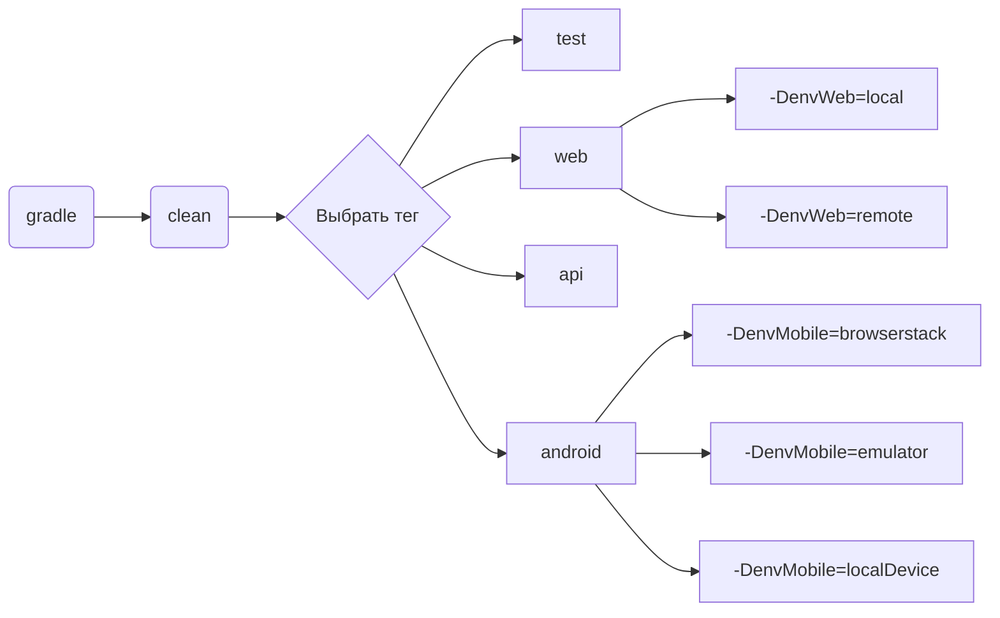

<h1>Проект автоматизации тестирования <a target="_blank" href="https://kz.siberianwellness.com/kz-ru/">Siberian Wellness</a></h1>

## Содержание
+ [Описание](#описание)
+ [Особенности проекта](#особенности-проекта)
+ [Технологии и инструменты](#технологии-и-инструменты)
+ [Реализованные проверки](#реализованные-проверки)
+ [Запуск тестов](#запуск-тестов)
  + [Допустимые комбинации](#допустимые-комбинации)
+ [Cборка тестов в Jenkins](#cборка-тестов-в-jenkins)
+ [Интеграция с Allure report](#интеграция-с-ba-target_blank-hrefallure-reportab)
+ [Интеграция с Allure TestOps](#интеграция-с-ba-target_blank-hrefallure-testopsab)
+ [Интеграция с Jira](#интеграция-с-ba-target_blank-hrefjiraab)
+ [Уведомления в Telegram с использованием бота](#уведомления-в-telegram-с-использованием-бота)

## Описание
**Siberian Wellness** — международная Компания, выпускающая инновационные продукты для здоровья, красоты и спорта на основе дикорастущих сибирских трав и растений.

### Особенности проекта:
- `Page Object` шаблон проектирования
- Использование техноголии `Owner` для придания тестам гибкости и легкости конфигурации
- Возможность запуска тестов: локально, удалённо, по тегам
- Для наглядности построен график с допустимыми комбинациями для запуска тестов
- Использование `Faker` для генерации данных
- Использование `Lombok` для моделей в API тестах
- Использование собственных аннотаций:
    - `первая` для предварительной авторизации
    - `вторая`...
- Возможность запуска тестов напрямую из `Allure TestOps`, `Jenkins`
- По итогу прохождения автотестов генерируется `Allure отчет`. Содержание отчета:
    - Шаги теста
    - Скриншот страницы на последнем шаге
    - Исходный код страницы в браузере
    - Логи консоли браузера
    - Видео выполнения автотеста
- Интеграция с `Jira`
- Уведомление о результатах прохождения в `Telegram`

## Технологии и инструменты

## Реализованные проверки
### Web
- [x] Доступность главной страницы
- [x] Авторизация через главное меню по логину и паролю
- [x] Оформление заказа самовывозом и оплатой по карте(не оплачивать)
- [x] Отображение оформленного заказа в истории заказов
- [x] Возможность оплатить неоплаченный заказ
- [x] Проверка срабатывания валидации полей при добавлении адреса, если не заполнить обязательные поля
- [x] Добавление нового адреса доставки в личном кабинете
- [x] Удаление адреса доставки в личном кабинете
- [x] Выход из аккаунта

### Api
- [x] Работоспособность сервиса авторизации
- [x] Получение списка доступных акций в выбранном городе
- [x] Получение списка доступных ПВЗ в выбранном городе
- [x] Добавление товара в избранное
- [x] Удаление товара из избранного
- [x] Проверка на необходимость верификации номера телефона при использовании бонусов
- [x] Выход из аккаунта

### Mobile
- [x] Доступность главной страницы
- [x] Отображение иконок соцсетей на главной странице
- [x] Авторизация через главное меню по логину и паролю
- [x] Оформление заказа самовывозом и оплатой по карте(не оплачивать)
- [x] Отображение оформленного заказа в истории заказов
- [x] Возможность оплатить неоплаченный заказ
- [x] Выход из аккаунта

## Запуск тестов
Конфигурационные файлы `.properties` лежат в папке `resources`.  
При необходимости можно изменить их.
### Допустимые комбинации

## Cборка тестов в <b><a target="_blank" href="">Jenkins</a></b>

## Интеграция с <b><a target="_blank" href="">Allure report</a></b>

## Интеграция с <b><a target="_blank" href="">Allure TestOps</a></b>

## Интеграция с <b><a target="_blank" href="">Jira</a></b>

## Уведомления в Telegram с использованием бота